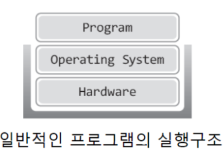
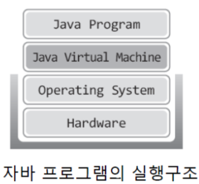
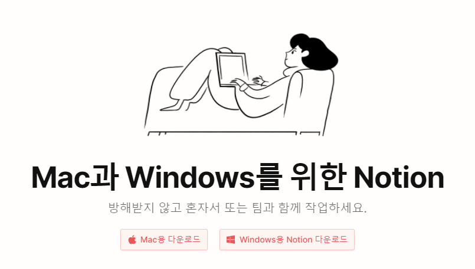

## 🎯 목표
### 자바 소스 파일(.java)을 JVM으로 실행하는 과정 이해하기.

### 📌 학습할 것
- [JVM이란 무엇인가](#-jvm이란-무엇인가)
- [컴파일 하는 방법](#-컴파일-하는-방법)
- [실행하는 방법](#-실행하는-방법)
- [바이트코드란 무엇인가](#-바이트코드란-무엇인가)
- [JIT 컴파일러란 무엇이며 어떻게 동작하는지](#-jit-컴파일러란-무엇이며-어떻게-동작하는지)
- [JVM 구성 요소](#-jvm-구성-요소)
- [JDK와 JRE의 차이](#-jdk와-jre의-차이)

---

### 💡 JVM이란 무엇인가

일반적인 프로그램은 Windows 또는 Linux와 같은 운영체제 위에서 실행이 된다. 즉, 아래와 같은 구조로 실행이 된다.

위 그림에 보이듯이 일반적인 프로그램은 하드웨어를 기반으로 운영체제가 동작을 하고, 그 위에서 프로그램이 실행되는 구조이다.

그러나 자바 프로그램은 아래와 같이 일반 프로그램과는 다른 구조로 실행이 된다.

그림을 보았듯이 자바 프로그램이 일반 프로그램과 비교해서 가장 큰 차이점은 운영체제와 자바 프로그램 사이에 자바 가상머신(JVM)이 존재하는 점이다.
즉 운영체제가 바로 프로그램일 실행시키는 것이 아니라, 운영체제는 JVM을 실행하고 JVM이 자바 프로그램을 실행시키는 구조이다.

그렇다면 JVM은 무엇이며, 자바 프로그램은 일반 프로그램과 같이 운영체제가 직접 프로그램을 실행시키는 구조를 따르지 않고 왜 JVM 위에서 동작하는 것인가?

일단 JVM도 다른 프로그램과 마찬가지로 운영체제 위에서 동작하는 소프트웨어이다. 자바 프로그램을 실행시키는 소프트웨어인 것이다.
이렇게 자바 프로그램이 JVM 위에서 동작하는 구조의 이유는 자바 프로그램을 운영체제와 상관없이 동작시키기 위함 이다.

프로그램은 운영체제에 따라서 달리 구현되어야 한다. 예를 들어 우리가 노션이라는 프로그램을 다운받을 때, 운영체제가 Windows인지 Mac인지 구분하여 프로그램을 다운받는다.
Windows에서 동작하도록 구현된 노션을 다운받으면 절대 Mac에서 설치할 수 없다.

따라서 동일한 기능의 노션이라 할지라도 Mac에서 동작을 시키려면 Mac을 기반으로 다시 구현해주어야 한다.

### 💡 컴파일 하는 방법

### 💡 실행하는 방법

### 💡 바이트코드란 무엇인가

### 💡 JIT 컴파일러란 무엇이며 어떻게 동작하는지

### 💡 JVM 구성 요소

### 💡 JDK와 JRE의 차이
