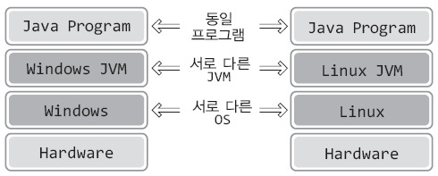
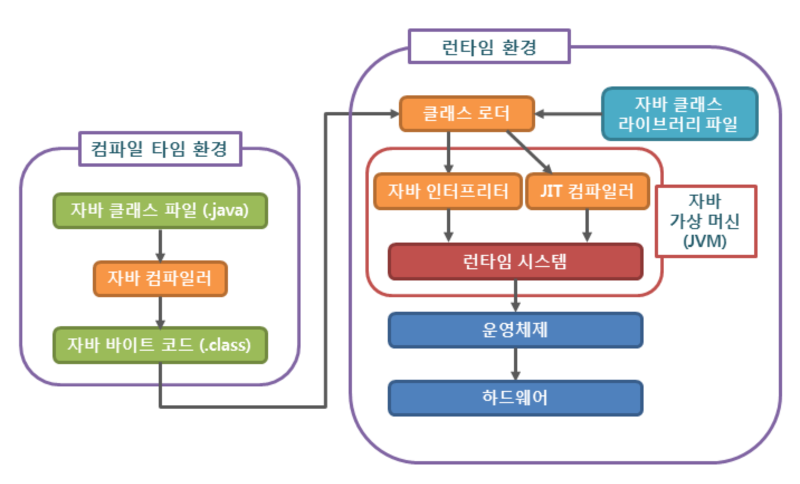

## 🎯 목표
### 자바 소스 파일(.java)을 JVM으로 실행하는 과정 이해하기.

### 📌 학습할 것
- [JVM이란 무엇인가](#-jvm이란-무엇인가)
- [컴파일 하는 과정](#-컴파일-하는-과정)
- [컴파일 및 실행하는 방법](#-컴파일-및-실행하는-방법)
- [바이트코드란 무엇인가](#-바이트코드란-무엇인가)
- [JIT 컴파일러란 무엇이며 어떻게 동작하는지](#-jit-컴파일러란-무엇이며-어떻게-동작하는지)
- [JVM 구성 요소](#-jvm-구성-요소)
- [JDK와 JRE의 차이](#-jdk와-jre의-차이)

---

### 💡 JVM이란 무엇인가

일반적인 프로그램은 Windows 또는 Linux와 같은 운영체제 위에서 실행이 된다. 즉, 아래와 같은 구조로 실행이 된다.

<p align="center"></p>

위 그림에 보이듯이 일반적인 프로그램은 하드웨어를 기반으로 운영체제가 동작을 하고, 그 위에서 프로그램이 실행되는 구조이다.

그러나 자바 프로그램은 아래와 같이 일반 프로그램과는 다른 구조로 실행이 된다.

<p align="center"></p>

그림을 보았듯이 자바 프로그램이 일반 프로그램과 비교해서 가장 큰 차이점은 운영체제와 자바 프로그램 사이에 자바 가상머신(JVM)이 존재하는 점이다.
즉 운영체제가 바로 프로그램일 실행시키는 것이 아니라, 운영체제는 JVM을 실행하고 JVM이 자바 프로그램을 실행시키는 구조이다.

그렇다면 JVM은 무엇이며, 자바 프로그램은 일반 프로그램과 같이 운영체제가 직접 프로그램을 실행시키는 구조를 따르지 않고 왜 JVM 위에서 동작하는 것인가?

일단 JVM도 다른 프로그램과 마찬가지로 운영체제 위에서 동작하는 소프트웨어이다. 자바 프로그램을 실행시키는 소프트웨어인 것이다.
이렇게 자바 프로그램이 JVM 위에서 동작하는 구조의 이유는 자바 프로그램을 운영체제와 상관없이 동작시키기 위함 이다.

<p align="center"></p>

프로그램은 운영체제에 따라서 달리 구현되어야 한다. 예를 들어 우리가 노션이라는 프로그램을 다운받을 때, 운영체제가 Windows인지 Mac인지 구분하여 프로그램을 다운받는다.
Windows에서 동작하도록 구현된 노션을 다운받으면 절대 Mac에서 설치할 수 없다.

따라서 동일한 기능의 노션이라 할지라도 Mac에서 동작을 시키려면 Mac을 기반으로 다시 구현해주어야 한다.

> __왜 운영체제에 따라서 프로그램을 달리 구현해야 할까?__
> 
> 개발 언어가 다르기 때문이 아니라, 언어가 동일할지라도 운영체제에 따라서 프로그램을 완성하는 방식 자체가 다른 일부 기능이 존재하기 때문이다.
>
> 예를 들어서 그래픽, 키보드, 마우스 같은 하드웨어 IO 관련 기능들은 운영체제에 의해 제공되기 때문에, 운영체제가 달라지면 개발 언어와 상관없이 기능의 완성방법이 달라진다. 
> 즉 하나의 프로그램이 서로 다른 운영체제에서 동작하는 것은 거의 불가능한 일이다.

다시 돌아와서 자바로 프로그램을 구현하면 운영체제에 상관없이 프로그램을 동작시킬 수 있는 장점이 있다. 운영체제에 따른 차이점을 바로 JVM이 대신 처리해주기 때문이다.

<p align="center"></p>

위 그림을 보면 운영체제 별로 존재하는 차이점을 JVM에서 다 처리하였기 때문에 자바 프로그램은 운영체제와 독립적으로 실행이 된다.

하지만 아까 말했듯이 JVM은 운영체제 위에서 동작하는 소프트웨어기 때문에 운영체제에 의존적이여서 Windows에는 Windows의 JVM이 필요하고, Mac에는 Mac에서의 JVM이 필요하게 된다.

---

### 💡 컴파일 하는 과정

위에서 살펴 보았듯이 자바는 OS에 독립적이라는 특징을 가지고 있다. 그리고 그게 가능한 이유는 자바 프로그램과 OS사이에 존재하고 있는 JVM 덕분이라는 것도 알게되었다. 

그렇다면 JVM의 어떠한 기능 때문에, OS에 독립적으로 실행시킬 수 있는지 자바 컴파일 과정을 통해 알아보도록 하자.

<p align="center"></p>

1. 개발자가 자바 소스파일(.java)를 작성한다.

2. 자바 컴파일러(Java Compiler)가 자바 소스파일을 컴파일한다.
컴파일러가 컴파일을 완료하면 자바 바이트 코드(.class)파일이 생성된다. 이 파일은 JVM만 읽을 수 있으며 아직 OS까지는 읽을 수 없는 이다.

3. 바이트 코드가 JVM의 클래스 로더(Class Loader)에게 전달된다. 클래스 로더에 전달되는 순간부터 런타임 환경에 접어든다.

4. 클래스 로더에서는 동적 로딩을 통해 필요한 클래스들을 로딩하여 JVM 메모리에 올린다. JVM 메모리는 런타임 데이터 영역(Runtime Data Area)이라고 한다.

5. 실행엔진(Execution Engine)에서 JVM 메모리에 올라온 바이트 코드들을 명령어 단위로 하나씩 가져와서 실행한다. 
이때, 실행 엔진은 두가지 방식으로 변경한다.

- __자바 인터프리터__ : 바이트 코드 명령어를 하나씩 읽어서 해석하고 실행한다. 하나하나의 실행은 빠르나, 전체적인 실행 속도가 느리다는 단점이 있다.

- __JIT 컴파일러(Just-In-Time Compiler)__ : 바이트 코드 전체를 컴파일하여 바이너리 코드로 변경하고 이후에는 해당 메서드를 더 이상 인터프리팅 하지 않고, 바이너리 코드로 직접 실행하는 방식이다. 
인터프리터의 단점을 보완하기 위해 도입된 방식으로, 하나씩 인터프리팅하여 실행하는 것이 아니라 바이트 코드 전체가 컴파일된 바이너리 코드를 실행하는 것이기 때문에 전체적인 실행속도는 인터프리팅 방식보다 빠르다.


### 클래스 로더내에서의 세부 동작
__a. 로드 :__ 컴파일된 바이트 코드와 필요한 자바 클래스 라이브러리 파일을 가져와서 JVM의 메모리에 로드한다.

__b. 검증 :__ 메모리에 로드된 파일이 자바 언어 명세(Java Language Specification) 및 JVM 명세에 명시된 대로 구성되어 있는지 검사한다.

__c. 준비 :__ 클래스가 필요로 하는 메모리를 할당한다. (필드, 메서드, 인터페이스 등등) 

__d. 분석 :__ 클래스의 상수 풀 내 모든 심볼릭 레퍼런스를 다이렉트 레퍼런스로 변경한다.

> 기본 자료형(primitive data type)을 제외한 모든 타입(클래스와 인터페이스)을 명시적인 메모리 주소 기반의 레퍼런스가 아니라, 실행 시 Link를 할 수 있는 심볼릭 레퍼런스를 통해 참조한다.
> 
> 심볼릭 레퍼런스는 메모리 번지의 참조를 의미하는 것이 아니라 이름에 의한 참조를 의미한다.
> 
> 이 심볼릭 레퍼런스가 앞의 로드 - 검증 - 준비 과정을 거치고 실제 물리적인 주소인 다이렉트 레퍼런스로 대체되는 작업인 다이나믹 Linking이 이 단계에서 일어난다.

__e. 초기화 :__ 클래스 변수들을 적절한 값으로 초기화한다.(static 필드)


### 💡 컴파일 및 실행하는 방법

> Test.java

```java
class Hello{

    public static void main(String[] args){
        System.out.println("Hello Java!");
    }

}
```

위와 같은 자바 소스파일이 있을 때, 자바 소스파일을 컴파일 하는 방법은 아래와 같다.

> $ javac Test.java

javac(java compile or java compiler) 명령어로 자바 컴파일러가 자바 파일을 컴파일한다.

성공적으로 컴파일을 마친다면, 해당 경로에 Hello.class 파일이 생성된다.

컴파일 결과로 생성된 Hello.class 파일이 바로 자바 바이트 코드이다.

자바 바이트 코드를 실행시켜야 우리가 원하는 출력을 확인할 수 있다.

> $ java Hello

```
> Hello Java!
```

위 java 명령어로 자바 바이트 코드파일을 자바 인터프리터가 해석하고 실행한다.

여기서 주목할 점은 Test.java 파일을 컴파일한 결과는 Test.class가 아니다.

Test는 포장지 이름이고 포장 속 알멩이는 Hello 클래스이다.

컴파일 결과 생성된 파일은 Class 이름의 Hello.class 파일이 생성된다.

### 💡 바이트코드란 무엇인가


### 💡 JIT 컴파일러란 무엇이며 어떻게 동작하는지


### 💡 JVM 구성 요소


### 💡 JDK와 JRE의 차이
