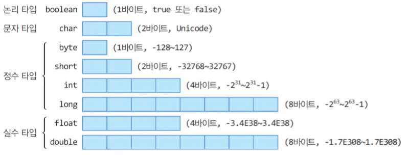
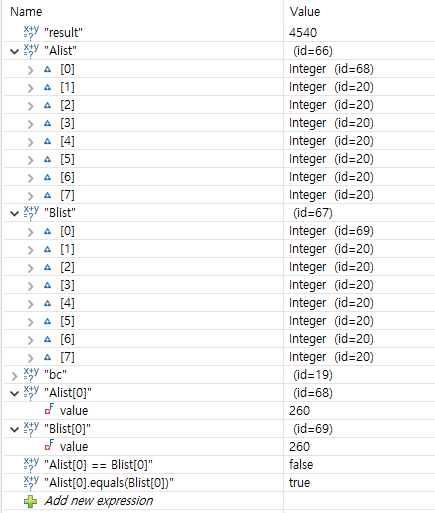

## 🎯 목표
### 자바의 Primitive 타입, 변수 그리고 배열을 사용하는 방법을 익히기.

### 📌 학습할 것
- [Primitive 타입 종류와 값의 범위 그리고 기본 값](#-primitive-타입-종류와-값의-범위-그리고-기본-값)
- [Reference 타입](#-reference-타입)
- [Literal](#-literal)
- [변수 선언 및 초기화하는 방법](#-변수-선언-및-초기화하는-방법)
- [변수의 스코프와 라이프타임](#-변수의-스코프와-라이프타임)
- [타입 변환, 캐스팅 그리고 타입 프로모션](#-타입-변환-캐스팅-그리고-타입-프로모션)
- [배열](#-배열)
- [타입 추론, var](#-타입-추론-var)

---

### 💡 Primitive 타입 종류와 값의 범위 그리고 기본 값

<p align="center"></p>

**Primitive type 종류**
- 원자성의 Data
- 수의 표현 범위 : byte < short < int < long < float < double     

```
                  타입 종류           용량          기본 값
-----------------------------------------------------------------------------------------------
                  boolean           1 bit	    false     (숫자 호환 X)
                  char              2 bytes         '\u0000'  ('a'(문자) != "a"(문자열 ; 객체))
                  
              |   byte              1 byte          0       ▲ 명시적 형변환
              |   short             2 bytes         0       |
              |   int(default)      4 bytes         0       |
              |   long              8 bytes         0L      |
              |   float             4 bytes         0.0f    |
묵시적 형변환  ▼   double(default)   8 bytes         0.0d    |

```

---

### 💡 Reference 타입
**Reference type** = All type - Primitive type

**non-Primitive type**
- Reference type; 참조타입
- Class type
- Interface type
- Array type
    
java는 2Bytes체제의 유니코드를 지원한다. 
유니코드는 u0000 ~ uffff까지 표현됨
u00[**]에서 [**]의 1바이트는 ASCII코드
```java
char ch = 'A';
char ch = 65;
char ch = '\u0041'; //A의 유니코드표기 (4*16^1+1*16^0 = 65)
```

<p align="center"></p>

> **Wrapper Class ?** Primitive Type을 Boxing하여 객체화하는 클래스!
> 
> 8개의 Primitive Type에 각각 대응되게 다 존재함.
> 
> java 5.0 부터 사용자들이 int와 Integer가 서로 호환되는 것 처럼 느껴지게 Auto Boxing, Auto UnBoxing을 지원함.
> 
> 따라서 java의 모든 데이터타입은 객체로 표현이 가능해진다. 그래서 최상위 타입인 Object Type은 다형성 때문에 존재.

```java
Integer i = new Integer(10);
```

> 하지만 
> String 도 객체인 것처럼, 엄연히 Wrapper Class도 객체임을 잊으면 안된다.
> 
> 경우에 따라, 아래 이미지와 같은 상황도 발생할 수 있다.
> equals로 값은 동일하지만 == 가 서로 다르다는 결과를 보일 때도 있다.

<p align="center"></p>

---

### 💡 Literal
**Literal** : 자바 코드에 직접 '값'을 명시하면 리터럴로 분류함
소스 코드의 고정된 값을 대표하는 용어

**Literal 종류**

Primitive 타입과 같이 정수, 실수, 문자, 논리, 문자열 리터럴이 있다.

**1. 정수 리터럴**

10진수, 8진수, 16진수, 2진수 형태로 표현한 값이다.
```java
int a = 15;
int b = 015;
int c = 0x15;
int d = 0b0101;
```
정수 리터럴은 int 형이 default이다.

long 타입 리터럴은 숫자 뒤에 L 또는 l을 붙여 표시하여야 한다. ( long a = 26L; )

**2. 실수 리터럴**

소수점 형태나 지수 형태로 표현한 값이다.

실수 리터럴도 마찬가지로 double 형이 default이다.
```java
double a = 0.1234;
double b = 1234E-4; 
```
a = 0.1234 와 b = (1234*10*(-4)는 동일한 값

long 타입 리터럴은 숫자 뒤에 L 또는 l을 붙여 표시하여야 하듯이, float 타입 리터럴도 f를 꼭 붙여줘야한다. ( float h = 0.1234f; )

**3. 문자 리터럴**

단일 인용부호(' ')로 문자를 표현한다.
```java
char a = 'H';
char b = "한";
char c = \uae00;(유니코드값) // \u다음에 4자리 16진수로, 2바이트의 유니코드(Unicode))
```
아래와 같이 각각의 기능을 가지는 특수문자 리터럴도 존재한다.

<p align="center"></p>

**4. 논리 리터럴**

boolean 타입 변수에 치환하거나 조건문에 이용한다.
```java
boolean flag1 = true;

//Java에서는 다른 언어와 달리 0 과 1이상 수가 논리 리터럴이 될 수 없다.
boolean flag2 = 1; // 컴파일 에러!
```
반드시 true, false만이 논리 리터럴이 된다.

**5. 문자열 리터럴**

문자열은 Primitive type이 아니고 엄연히 Reference type 객체이다. 

이중 인용부호 (" ")로 문자열을 표현한다. 
```java
String str1 = new String("a");
String str2 = new String("a");
String str3 = "a";
String str4 = "a";
```
- str1과 str2는 새롭게 Heap 공간에 만듦, 즉 서로 참조값이 다른 다른 객체이다.
- str3에서 문자열 "a"를 선언하면 이 "a"는 heap에 올라가는 것이 아닌 재사용하기 위해 리터럴풀에 넣고 그 "a"를 참조한다.
- 문자열은 변경이 되지않고 변경을 하려면 새롭게 선언을 해야하기 때문에 리터럴로 활용이 가능하다.
- 그리고 str4에서 문자열 "a"를 다시 선언하면, str4는 리터럴풀을 둘러보고 "a"가 있는 것을 발견하고 그 "a"를 참조한다.
- 따라서 str3과 str4는 리터럴풀에 있는 같은 "a"를 참조한다. 
- str1은 Heap에 새롭게 만든 String 메모리를, str3는 리터럴풀의 "a"를 참조하므로 다른 참조값을 가진다.

---

### 💡 변수 선언 및 초기화하는 방법


---

### 💡 변수의 스코프와 라이프타임

---

### 💡 타입 변환, 캐스팅 그리고 타입 프로모션

---

### 💡 배열

__Reference Type (객체)__

**장점**
- 데이터 관리 용이함
  - 반복문과 결합하여 일괄처리 가능
  - 리턴값, 매개변수 전달시 활용 가능

- 처리성능 효율적

**단점**
- 크기가 고정적 (하지만 고정이기 때문에 처리성능이 효율적이게 됨)
  - 크기를 변경하고 싶으면 배열 새로 생성

**배열 생성**
```java
// 1차원 배열 생성
데이터타입[] 참조변수 = new 데이터타입[size];

// 2차원 배열 생성
데이터타입[][] 참조변수 = new 데이터타입[size][]; // 새로 선언하는 배열의 사이즈만 명시해줘도 된다. 
```

**배열 사용**
```java
// 1차원 배열 사용
데이터타입 변수 = 참조변수[index];

// 2차원 배열 사용
데이터타입 변수 = 참조변수[index1][index2];
```
index는 첫번째 원소 기준 offset 개념

그렇기 때문에, 0 ~ 길이-1 까지가 유효인덱스가 됨

**배열 초기화**
```java
// 1차원 배열 초기화
데이터타입[] 참조변수 = new 데이터타입[]{값1,값2,,,,};
데이터타입[] 참조변수 = {값1,값2,,,,};

//초기화를 할 때는 들어간 초기값의 개수에 따라 자동으로 size가 결정되기 때문에 직접 size를 명시하지 않는다. 
데이터타입[] 참조변수 = new 데이터타입[size]{값1,값2,,,,}; // 컴파일 에러

// 2차원 배열 초기화
데이터타입[][] 참조변수 = new 데이터타입[][]{{값1, 값2,,,,}, {값1, 값2,,,,}, {값1, 값2,,,,}};
데이터타입[][] 참조변수 = {{값1, 값2,,,,}, {값1, 값2,,,,}, {값1, 값2,,,,}};
```

---

### 💡 타입 추론, var
